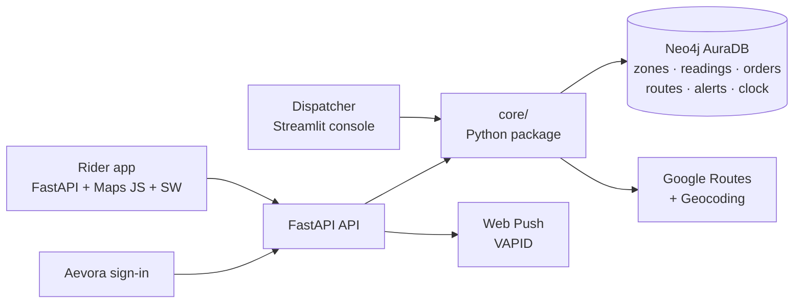

# Aevora — Exposure-Aware Fleet Routing for Delhi NCR

> **Route delivery riders around the worst air, without missing the delivery window.**
> Built for the Ignite with Delhi hackathon · Powered by **Neo4j**

Delhi's delivery riders spend 8–10 hours a day on the road in some of the most
polluted air on earth. Navigation apps optimise for minutes. Aevora optimises for
**minutes *and* PM2.5 dose**: it pulls live traffic-aware routes from Google, scores
each one against a zone-level pollution graph in Neo4j, and recommends the route
that cuts the rider's exposure while still meeting the delivery window. When the
air ahead of a rider suddenly gets worse, the rider is alerted and offered a
cleaner reroute, with the trade-off in extra minutes and dose saved.

> **Honest by design.** The pollution layer is a **replay** of historical sensor
> data (Delhi NCR, January 2021) on a demo clock. Traffic and routing are **live**
> from Google today. Injected spikes are always labelled **Simulated**. Scores show
> relative *exposure reduction*, never a health or medical claim.

---

## Demo in 3 minutes

| # | As | Do | You'll see |
|---|---|---|---|
| 1 | — | Open `http://127.0.0.1:8010/` | The Aevora sign-in (a rider clearing the smog). Press any key to skip the intro. |
| 2 | Dispatcher | Sign in → **Plan & dispatch** → Drop: `Karol Bagh` → **Find cleanest route** | Live Google alternatives on a dark map, each scored separately for **time, dose, window margin and coverage**. The recommendation comes with a one-line reason. |
| 3 | Dispatcher | **Dispatch to rider** → Rider 1 | The order appears on **Live fleet**. |
| 4 | Rider | New tab → `http://127.0.0.1:8010/?role=rider` → sign in as Rider 1 → **Navigate** | Turn-by-turn navigation: next-turn banner, ETA, km left, dose so far, and air quality ahead. |
| 5 | Dispatcher | **Live fleet** → *Spike the air ahead of a rider* → pick a zone marked **avoidable** → **Inject simulated spike** | A *Severe · Simulated* alert in the dispatcher feed and on the rider's screen, plus a web push if it's enabled. |
| 6 | Rider | **See cleaner route** → **Take cleaner route** | For example: *"Reroute adds +2 min and cuts exposure 22%"*. The new live route is drawn and the alert clears. |
| 7 | Dispatcher | Press **Play** (try 10–30×) | The rider moves along the real route in replay time, then arrives and the delivery completes. |

**Demo start:** the **Demo start** button jumps the replay to *Wed 27 Jan 2021, 14:00 IST*. At that moment 172 of 195 zones are reporting and the air is moderate, so a spike clearly crosses the alert threshold. Hub → Karol Bagh is a reliable scenario: it has three real alternatives and zones that only one of them passes through.

## Demo accounts (static credentials — demo only)

| Role | Sign in with | Password |
|---|---|---|
| Dispatcher | `dispatch@aevora.in` | `aevora-dispatch` |
| Riders 1–8 | `+91 99000 00001` … `+91 99000 00008` | `aevora-rider` |

Each rider phone number maps to a rider already seeded in the graph (`rider-1` … `rider-8`, based at the South Delhi Hub). A dispatcher and a rider can be signed in side by side in the same browser.

---

## What's inside

**Dispatcher console** (Streamlit, Aevora theme)
- **Live fleet**: every active delivery moving on a Google map in replay time, KPIs, open alerts, and the spike-injection demo control. The control flags which zones are avoidable.
- **Plan & dispatch**: place search → up to 3 live alternatives → side-by-side comparison → turn-by-turn → dispatch to an available rider.
- **Air & alerts**: inspect the zone layer at any replay moment, plus the full alert log with filters and acknowledge.

**Rider app** (FastAPI-served, mobile-first)
- Today's deliveries with progress, an air-alert feed, and a web push opt-in (VAPID and a service worker, with in-app alerts as the fallback).
- Live navigation: real route, a heading-aware rider arrow, the next turn from Google's steps, dose so far / trip, air ahead, and **one-tap reroute** with a clear time-vs-dose comparison.

**Engine** (`core/`, framework-free Python used by both front ends)
- Google **Routes API** (two-wheeler, traffic-aware, alternatives) and **Geocoding**, plus a read of the alias → place knowledge graph.
- Dose scoring on H3 zones against the replayed Neo4j layer, the decision rule, alerting, and reroute.
- A **derived replay clock** stored in Neo4j, so it survives restarts and Render sleep.

## How the scoring works

**Dose** (µg·h/m³, relative) = Σ over zones of `PM2.5(zone, arrival bucket) × hours in zone × activity factor`.

1. The live Google polyline is split into H3 resolution-8 zones (about 460 m across).
2. Google's traffic-aware duration is shared across the zones by distance.
3. Each zone's arrival time selects its 15-minute pollution bucket.
4. The concentration used is **PM2.5, not AQI**.

**Gaps:** a zone with no reading at that moment is filled with the **city-wide mean for the same bucket**.
- Counting a gap as zero would make the route with the *least data* look cleanest.
- **Coverage** reports only the measured share of the ride. Below 80% coverage the route is flagged **low confidence** in the UI.

**Decision rule** (per the PRD):
1. Take up to 3 alternatives.
2. Drop any that would miss the window with less than a 2-minute buffer.
3. Pick the **lowest dose**; if two tie, take the shorter one.
4. If no route qualifies, recommend the fastest and flag **window at risk**.

The delta versus the fastest route is always shown.

**Alerts = the air got worse after planning.**
- Replayed history is already priced into the route choice. In mid-January Delhi nearly every zone is above 120 µg/m³, so a plain threshold would fire on every ride.
- Aevora alerts only when a zone *ahead of the rider*:
  - crosses **120 µg/m³** from at or below its planned value, **or**
  - rises **≥ 25%** above its planned value.
- Alerts are deduplicated per rider and zone within 15 replay-minutes.

**Severity bands (PM2.5, µg/m³):**

| Band | Range |
|---|---|
| Good | 0–30 |
| Satisfactory | 31–60 |
| Moderate | 61–90 |
| Poor | 91–120 |
| Very poor | 121–250 (alert threshold) |
| Severe | > 250 |

## Architecture



- **One shared engine, two thin front doors.** There's no scoring logic in `api/` or `ui/`. Streamlit calls `core/` directly; the REST API serves the rider app.
- **State lives in Neo4j**, never on local disk: the replay clock, orders, route scores, alerts and push subscriptions.
- **Only derived data is persisted from Google**: route scores and the ordered zone list (`PASSES_THROUGH {idx, seconds, bucket, pm25_planned}`). Route geometry stays in memory, is re-fetched when needed, and is only ever drawn on a Google map.

**Graph (operational layer):**

```
Rider -[:ASSIGNED]-> Order -[:HAS_CANDIDATE]-> Route {selected} -[:PASSES_THROUGH]-> Zone <-[:OF]- ZoneReading {ts, pm25, source}
Alert -[:ABOUT]-> Rider         Rider -[:HAS_SUBSCRIPTION]-> PushSub         (DemoClock)
```

## The data

| | |
|---|---|
| Source | Low-cost PM2.5 sensor network, Delhi NCR, 10–30 Jan 2021 |
| In Neo4j | **195** H3 zones · **155,043** zone readings (15-min medians) · 13 sensors |
| Coverage | ~170 zones report in the daytime and ~35 overnight, so the demo runs in the daytime |
| Confidence | 2+ sensors within 3 km = high, 1 = medium, 0 = zone excluded |

## Quick start

```bash
python -m venv .venv
.venv\Scripts\activate                     # Windows  (source .venv/bin/activate on macOS/Linux)
pip install -r requirements.txt
copy .env.example .env                     # fill in the values below
python scripts/generate_vapid_keys.py      # paste the keys it prints into .env
```

Minimum `.env`:

| Variable | Purpose |
|---|---|
| `NEO4J_URI`, `NEO4J_USERNAME`, `NEO4J_PASSWORD` | AuraDB with the zone layer loaded |
| `GOOGLE_MAPS_API_KEY` | Needs **Routes API**, **Geocoding API** and **Maps JavaScript API** enabled |
| `VAPID_PUBLIC_KEY`, `VAPID_PRIVATE_KEY`, `VAPID_SUBJECT` | Web push |
| `SESSION_SECRET` | Signs sessions: `python -c "import secrets; print(secrets.token_urlsafe(32))"` |
| `USE_MOCKS=false` | Use live routing (set `true` for offline mock data) |
| `PUBLIC_API_URL`, `CONSOLE_URL` | How the two services link to each other (defaults below) |

Run both services:

```bash
# Terminal 1 - API, sign-in page, rider app
uvicorn api.main:app --reload --port 8010

# Terminal 2 - dispatcher console
streamlit run ui/app.py --server.port 8501
```

Then open **http://127.0.0.1:8010/**.

> On Windows, port 8000 is often reserved by Hyper-V/WSL (`WinError 10013`). That's why the defaults use 8010.

## API

Interactive docs: `http://127.0.0.1:8010/docs`

| Endpoint | Access | Purpose |
|---|---|---|
| `GET /` · `POST /api/auth/login` · `GET /logout` · `GET /api/auth/me` | public / session | Aevora sign-in with per-role session cookies |
| `POST /api/places/resolve` | public | Alias graph → Google Geocoding (Delhi NCR bounds) |
| `POST /api/routes/plan` | public | Live alternatives, scored and ranked, with a recommendation |
| `GET /api/zones?ts=` | public | Zone layer at a replay moment (simulated readings override sensor ones) |
| `POST /api/orders/{id}/assign` | dispatcher | Persist the order, route scores and zone list; assign a rider |
| `GET/POST /api/demo/clock` · `POST /api/demo/spike` · `POST /api/demo/reset` | dispatcher | Replay clock and simulated spikes |
| `GET /api/fleet/live` | dispatcher (cookie or Bearer) | Live positions for the console map |
| `GET /api/rider/orders` · `GET …/{id}/navigation` · `GET/POST …/{id}/reroute` | rider (own orders only) | Deliveries, live navigation, reroute preview and commit |
| `GET /api/alerts` · `POST /api/alerts/{id}/ack` | session (riders see their own) | Alert feed |
| `GET /api/clock` | session | Read-only replay time |
| `POST /api/push/subscribe` · `GET /api/push/vapid-public-key` · `GET /sw.js` | rider / public | Web push |

## Project structure

```
api/            FastAPI: routers, auth, sign-in template, rider app static files (nav.js, sw.js)
core/
  navigation/   Google client, polyline geometry, dose scoring, planner, assignments + reroute
  alerts/       evaluator (crossing rule, dedupe) + web push sender
  clock/        derived replay clock, spike injector, zones-by-time
  auth.py       static demo accounts + signed session tokens
  schemas/      shared Pydantic contracts (v0 + additive fields)
  db/           shared Neo4j driver + timezone helpers
ui/             Streamlit console: app.py (auth gate + navigation), views/, maps, theme
tests/          pytest: unit, Neo4j integration, HTTP and headless-Streamlit tests
scripts/        VAPID key generator
.streamlit/     Aevora theme for the console
```

## Tests

```bash
pytest -q
```

- The suite runs against the **real AuraDB** for the clock, spikes, alerts, push and navigation persistence.
- **Google is stubbed** in the tests, so they don't depend on live traffic or API quota.
- Contract and UI tests pin `USE_MOCKS=true` (see `tests/conftest.py`).

## Known limitations & next steps

- **Authentication is static demo accounts** (hard-coded, HMAC-signed session cookies). This needs a real identity provider before any real use.
- **Coverage is uneven.** Readings come from a small, partly mobile sensor network, so routes through unsensed areas lean on the city-mean fill and are shown as low confidence.
- **Route explanations are a template sentence** built from graph numbers. The Gemini-grounded explanation described in the PRD isn't wired yet, and `GEMINI_API_KEY` is optional.
- **Web push** needs HTTPS in production (Render provides it). On iOS it only works when the site is added to the Home Screen.
- **Deployment:** `render.yaml` is still the starter blueprint. Production needs two services:
  - `uvicorn api.main:app --host 0.0.0.0 --port $PORT`
  - `streamlit run ui/app.py --server.port $PORT --server.address 0.0.0.0`

  Set `PUBLIC_API_URL`/`CONSOLE_URL` so the two services point at each other. On free tiers, wake both services and check AuraDB isn't paused before a demo.
- **Track A integration:** the scoring lives in `core/navigation/` alongside (not inside) the core modules owned by the other track. It writes the same graph shape so it can be swapped cleanly.
- **Maps API keys:** one key currently serves both the server and the browser. Split out a referrer-restricted browser key before deploying. **Places API (New)** and the legacy **Directions API** aren't needed.

## Team

| Track | Owner | Scope |
|---|---|---|
| A — Core data & scoring | Teammate | ETL, zone layer, knowledge graph, seeding |
| B — Front doors | Vinay | API, sign-in and auth, dispatcher console, rider app and navigation, replay clock, spikes, alerts, web push |

See `docs/prd.md` for the full product requirements and information architecture.
